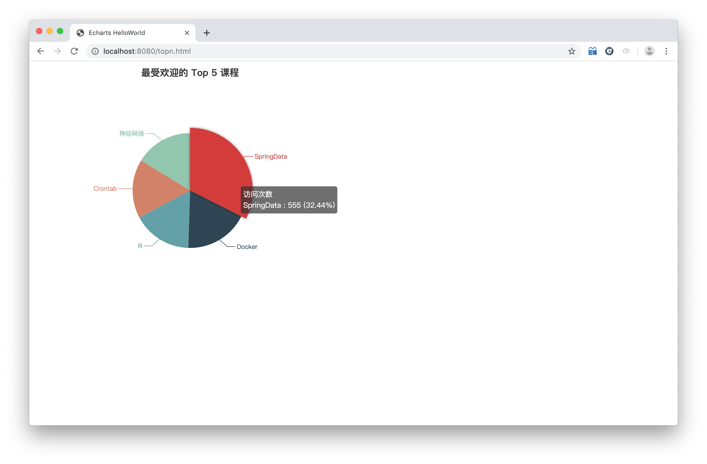

# imooc_sparksql_project

## 项目简介

使用 SparkSQL 对imooc网站的用户行为日志数据进行数据清洗，根据需求进行数据处理，将结果存进数据库，并进行可视化展示。

#### 原始数据
```
183.162.52.7 - - [10/Nov/2016:00:01:02 +0800] "POST /api3/getadv HTTP/1.1" 200 813 "www.imooc.com" "-" cid=0&timestamp=1478707261865&uid=2871142&marking=androidbanner&secrect=a6e8e14701ffe9f6063934780d9e2e6d&token=f51e97d1cb1a9caac669ea8acc162b96 "mukewang/5.0.0 (Android 5.1.1; Xiaomi Redmi 3 Build/LMY47V),Network 2G/3G" "-" 10.100.134.244:80 200 0.027 0.027
```
- 原始数据内容包括：
	- 访问的系统属性： 操作系统、浏览器信息等；
	- 访问特征：点击的url、从哪个url跳转过来的(referer)、页面停留时间等；
	- 访问信息：session_id、访问IP（据此可得知访问城市）、访问时间等。

#### 需求
对每一天的数据：
1. 统计最受欢迎课程的 Top N 访问次数
2. 按地市（根据IP）统计最受欢迎的 Top N 访问次数
3. 按流量统计最受欢迎的 Top N 课程
4. ......

---
### 项目流程

#### 1.数据清洗

原始数据：
```
183.162.52.7 - - [10/Nov/2016:00:01:02 +0800] "POST /api3/getadv HTTP/1.1" 200 813 "www.imooc.com" "-" cid=0&timestamp=1478707261865&uid=2871142&marking=androidbanner&secrect=a6e8e14701ffe9f6063934780d9e2e6d&token=f51e97d1cb1a9caac669ea8acc162b96 "mukewang/5.0.0 (Android 5.1.1; Xiaomi Redmi 3 Build/LMY47V),Network 2G/3G" "-" 10.100.134.244:80 200 0.027 0.027
```

初步清洗：
| Date | URL | Traffic| IP |
|:----:| :----: | :----:| :----: |
|2017-05-11 14:09:14 |	http://www.imooc.com/video/4500	| 304 |218.75.35.226 |

进一步清洗：
| URL | cmsType | cmsId| Traffic | IP | City | Time |Date|
|:----:| :----: | :----:| :----: | :----: | :----: | :----: | :----: |
|http://www.imooc.com/video/4500   |video  |4500 |304  |218.75.35.226  |浙江省 |2017-05-11 14:09:14|20170511|

其中 `IP地址 -> 城市` 使用了https://github.com/wzhe06/ipdatabase。

#### 2.数据处理
- 统计最受欢迎课程的 Top N 访问次数（N=5）
```
dataDF.groupBy("day", "cmsId")
	.agg(count("cmsId").as("times"))
	.orderBy($"times".desc)
```
```
+--------+-----+-----+
|day     |cmsId|times|
+--------+-----+-----+
|20170511|14540|555  |
|20170511|14623|309  |
|20170511|14704|286  |
|20170511|4500 |283  |
|20170511|14390|278  |
+--------+-----+-----+
```
- 按地市（根据IP）统计最受欢迎的 Top N 访问次数（N=3）
``` 
TODO
dataDF.groupBy("day", "city", "cmsId")
	.agg(count("cmsId").as("times"))
	.orderBy($"times".desc)
```
```
+--------+----+-----+-----+----------+
|day     |city|cmsId|times|times_rank|
+--------+----+-----+-----+----------+
|20170511|北京市 |14540|123  |1         |
|20170511|北京市 |14390|66   |2         |
|20170511|北京市 |4000 |66   |3         |
|20170511|浙江省 |14540|115  |1         |
|20170511|浙江省 |14623|63   |2         |
|20170511|浙江省 |14390|58   |3         |
|20170511|广东省 |14540|107  |1         |
|20170511|广东省 |14623|71   |2         |
|20170511|广东省 |4500 |57   |3         |
|20170511|上海市 |14540|103  |1         |
|20170511|上海市 |14704|63   |2         |
|20170511|上海市 |14623|58   |3         |
|20170511|安徽省 |14540|107  |1         |
|20170511|安徽省 |14623|62   |2         |
|20170511|安徽省 |14390|57   |3         |
+--------+----+-----+-----+----------+
```
- 按流量统计最受欢迎的 Top N 课程（N=5）
```
dataDF.groupBy("day", "cmsId")
	.agg(sum("traffic").as("traffics"))
	.orderBy($"traffics".desc)
```
```
+--------+-----+--------+
|day     |cmsId|traffics|
+--------+-----+--------+
|20170511|14540|265581  |
|20170511|14623|160285  |
|20170511|4500 |142781  |
|20170511|14390|141713  |
|20170511|14704|141266  |
+--------+-----+--------+
```

#### 3.数据存储

在 MySQL 数据库中建立 `day_video_access_topn_stat`、 `day_video_city_access_topn_stat` 、`day_video_traffics_topn_stat` 表，将处理结果存入其中。

#### 4.数据可视化
使用 [ECharts](https://echarts.baidu.com) 模板展示统计数据，通过后端获取数据，展示在web页面。
- 最受欢迎的 Top 5 课程

